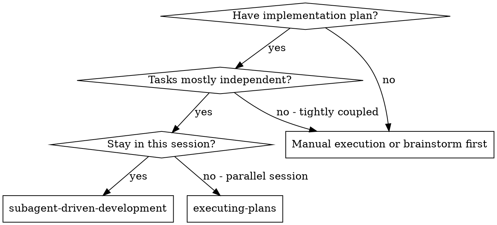
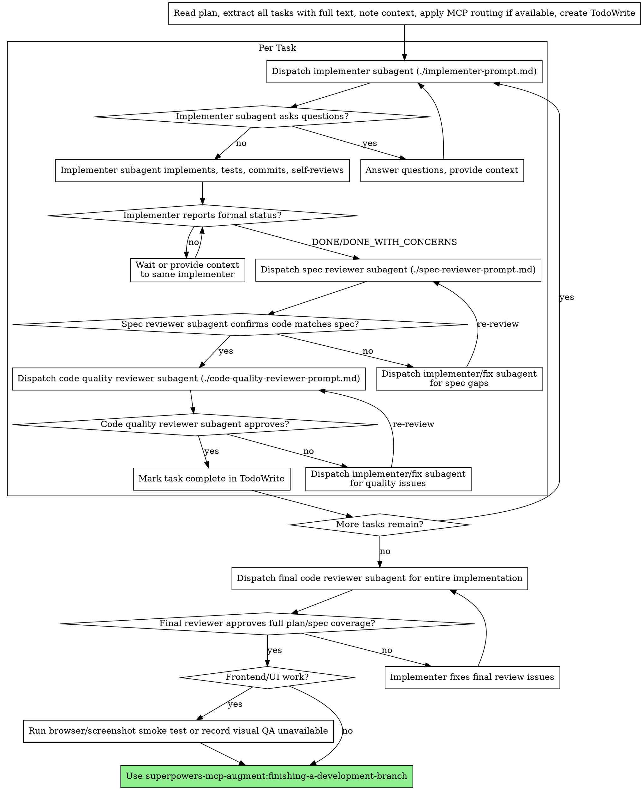

# Subagent-Driven Development

Execute plan by dispatching fresh subagent per task, with two-stage review after each: spec compliance review first, then code quality review.

**Why subagents:** You delegate tasks to specialized agents with isolated context. By precisely crafting their instructions and context, you ensure they stay focused and succeed at their task. They should never inherit your session's context or history — you construct exactly what they need. This also preserves your own context for coordination work.

**Core principle:** Fresh subagent per task + two-stage review (spec then quality) = high quality, fast iteration

**Continuous execution:** Do not pause to check in with your human partner between tasks. Execute all tasks from the plan without stopping. The only reasons to stop are: BLOCKED status you cannot resolve, ambiguity that genuinely prevents progress, or all tasks complete. "Should I continue?" prompts and progress summaries waste their time — they asked you to execute the plan, so execute it.

<CODEX-SUBAGENT-GATE>
In Codex, only spawn subagents when the user has explicitly chosen Subagent-Driven execution or otherwise explicitly asked for subagents/parallel agent work. The writing-plans handoff provides that choice. If the user has not chosen it, use `executing-plans` instead of silently spawning agents.
</CODEX-SUBAGENT-GATE>

<REVIEW-COVERAGE-GATE>
Review coverage follows implementation coverage. A review of scaffolding, setup, or an early slice does not approve later feature work.

For EVERY task that changes implementation behavior or UI, complete this sequence before moving on:
1. Implementer subagent reports DONE or DONE_WITH_CONCERNS.
2. Spec compliance reviewer independently checks actual files against that task.
3. Implementer fixes every spec issue and spec reviewer re-reviews.
4. Code quality reviewer reviews only after spec compliance passes.
5. Implementer fixes Critical/Important quality issues and reviewer re-reviews.

After the final task, dispatch a final reviewer for the whole implementation. The final reviewer must compare the complete diff against the full plan/spec, not just the last task.
</REVIEW-COVERAGE-GATE>

<IMPLEMENTER-COMPLETION-GATE>
Do not inspect files, run reviews, or infer task completion just because files appeared on disk. Wait for the task implementer subagent to report one of the formal statuses: DONE, DONE_WITH_CONCERNS, BLOCKED, or NEEDS_CONTEXT.

If the implementer has not reported a status, keep waiting or send that same implementer more context. Do not dispatch spec review, do not dispatch quality review, and do not start the next task.
</IMPLEMENTER-COMPLETION-GATE>

<CONTROLLER-NO-INLINE-EDITS-GATE>
In Subagent-Driven execution, the controller coordinates. It does not implement or fix task code inline.

When reviewer feedback requires code changes, dispatch the original implementer if still available, or a dedicated fix subagent with the exact reviewer findings and task scope. After the fix, run the same review stage again. Do not edit files yourself to "unblock" the flow.
</CONTROLLER-NO-INLINE-EDITS-GATE>

<NO-SILENT-INLINE-FALLBACK>
Do not switch a task from Subagent-Driven to inline execution because it looks simple, is "mostly content", takes too long, or an agent limit is reached. If an agent spawn fails, close completed agents or wait, then retry the required subagent at the same gate. If subagents are unavailable and no recovery is possible, stop and report the blocker to the user.
</NO-SILENT-INLINE-FALLBACK>

<PENDING-REVIEW-GATE>
Never move to Task N+1 while Task N has a pending implementer, pending spec review, pending quality review, failed reviewer spawn, unresolved DONE_WITH_CONCERNS, or unapplied/re-unreviewed fixes.

DONE_WITH_CONCERNS is not approval. Treat it as a gate that requires either a fix plus re-review, or an explicit documented decision that the concern is non-blocking and still within the task/plan. If the concern is about spec drift, it is blocking until spec review passes.
</PENDING-REVIEW-GATE>

<FRONTEND-VISUAL-GATE>
For frontend/UI work, build/test output is not enough to claim the interface is complete. Before completion, gather browser or screenshot evidence when a browser tool is available. If browser access is unavailable or blocked, state that visual QA was not completed and do not claim visual correctness.
</FRONTEND-VISUAL-GATE>

## When to Use



**vs. Executing Plans (parallel session):**
- Same session (no context switch)
- Fresh subagent per task (no context pollution)
- Two-stage review after each task: spec compliance first, then code quality
- Faster iteration (no human-in-loop between tasks)

## The Process



## Model Selection

Use the least powerful model that can handle each role to conserve cost and increase speed.

**Mechanical implementation tasks** (isolated functions, clear specs, 1-2 files): use a fast, cheap model. Most implementation tasks are mechanical when the plan is well-specified.

**Integration and judgment tasks** (multi-file coordination, pattern matching, debugging): use a standard model.

**Architecture, design, and review tasks**: use the most capable available model.

**Task complexity signals:**
- Touches 1-2 files with a complete spec → cheap model
- Touches multiple files with integration concerns → standard model
- Requires design judgment or broad codebase understanding → most capable model

## Handling Implementer Status

Implementer subagents report one of four statuses. Handle each appropriately:

**DONE:** Proceed to spec compliance review.

**DONE_WITH_CONCERNS:** The implementer completed the work but flagged doubts. Read the concerns before proceeding. If the concerns are about correctness or scope, address them before review. If they're observations (e.g., "this file is getting large"), note them and proceed to review.

**NEEDS_CONTEXT:** The implementer needs information that wasn't provided. Provide the missing context and re-dispatch.

**BLOCKED:** The implementer cannot complete the task. Assess the blocker:
1. If it's a context problem, provide more context and re-dispatch with the same model
2. If the task requires more reasoning, re-dispatch with a more capable model
3. If the task is too large, break it into smaller pieces
4. If the plan itself is wrong, escalate to the human

**Never** ignore an escalation or force the same model to retry without changes. If the implementer said it's stuck, something needs to change.

**No status yet:** Do not infer completion from filesystem changes. Continue waiting, or ask the implementer for a formal status update. Reviews only start after a formal status.

## Controller Discipline

The controller owns orchestration, not implementation.

**Allowed controller actions:**
- Read the plan once and extract exact task text
- Dispatch implementer/reviewer/fix subagents
- Wait for formal subagent statuses
- Summarize reviewer findings into the next subagent prompt
- Close completed agents to free capacity
- Run final verification/browser QA after all task gates pass

**Forbidden controller actions during task gates:**
- Editing task files directly
- Starting review before implementer status
- Moving to the next task with pending or failed review gates
- Reclassifying a Subagent-Driven task as inline because it is simple
- Treating `DONE_WITH_CONCERNS` as approval without resolving/documenting the concern

If a spawn fails because too many agents are open, close completed agents and retry the same required subagent. Do not skip that review/fix stage.

## Prompt Templates

- `./implementer-prompt.md` - Dispatch implementer subagent
- `./spec-reviewer-prompt.md` - Dispatch spec compliance reviewer subagent
- `./code-quality-reviewer-prompt.md` - Dispatch code quality reviewer subagent

When codebase-memory-mcp, Serena, or Caveman tools are available, include the routing instruction from superpowers-mcp-augment:mcp-routing in implementer and reviewer prompts.

For the final whole-implementation review, use the code quality reviewer template with:
- DESCRIPTION: Full implementation summary, not one task summary
- PLAN_OR_REQUIREMENTS: Complete spec and complete plan paths/content
- BASE_SHA: SHA or diff base before implementation began
- HEAD_SHA: current SHA or working-tree diff

If there is no git repository, provide the reviewer with an explicit file-change inventory and the relevant full file contents/diffs instead of SHAs.

## Example Workflow

```
You: I'm using Subagent-Driven Development to execute this plan.

[Read plan file once: docs/superpowers/plans/feature-plan.md]
[Extract all 5 tasks with full text and context]
[Create TodoWrite with all tasks]

Task 1: Hook installation script

[Get Task 1 text and context (already extracted)]
[Dispatch implementation subagent with full task text + context]

Implementer: "Before I begin - should the hook be installed at user or system level?"

You: "User level (~/.config/superpowers-mcp-augment/hooks/)"

Implementer: "Got it. Implementing now..."
[Later] Implementer:
  - Implemented install-hook command
  - Added tests, 5/5 passing
  - Self-review: Found I missed --force flag, added it
  - Committed

[Dispatch spec compliance reviewer]
Spec reviewer: ✅ Spec compliant - all requirements met, nothing extra

[Get git SHAs, dispatch code quality reviewer]
Code reviewer: Strengths: Good test coverage, clean. Issues: None. Approved.

[Mark Task 1 complete]

Task 2: Recovery modes

[Get Task 2 text and context (already extracted)]
[Dispatch implementation subagent with full task text + context]

Implementer: [No questions, proceeds]
Implementer:
  - Added verify/repair modes
  - 8/8 tests passing
  - Self-review: All good
  - Committed

[Dispatch spec compliance reviewer]
Spec reviewer: ❌ Issues:
  - Missing: Progress reporting (spec says "report every 100 items")
  - Extra: Added --json flag (not requested)

[Implementer fixes issues]
Implementer: Removed --json flag, added progress reporting

[Spec reviewer reviews again]
Spec reviewer: ✅ Spec compliant now

[Dispatch code quality reviewer]
Code reviewer: Strengths: Solid. Issues (Important): Magic number (100)

[Implementer fixes]
Implementer: Extracted PROGRESS_INTERVAL constant

[Code reviewer reviews again]
Code reviewer: ✅ Approved

[Mark Task 2 complete]

...

[After all tasks]
[Dispatch final code-reviewer]
Final reviewer: ✅ Full implementation matches the spec/plan. No blocking quality issues.
[Frontend work: run browser smoke test/screenshot review, or record visual QA unavailable]

Done!
```

## Advantages

**vs. Manual execution:**
- Subagents follow TDD naturally
- Fresh context per task (no confusion)
- Parallel-safe (subagents don't interfere)
- Subagent can ask questions (before AND during work)

**vs. Executing Plans:**
- Same session (no handoff)
- Continuous progress (no waiting)
- Review checkpoints automatic

**Efficiency gains:**
- No file reading overhead (controller provides full text)
- Controller curates exactly what context is needed
- Subagent gets complete information upfront
- MCP routing reduces broad file reads by using graph queries, symbol navigation, diagnostics, and compression where available
- Questions surfaced before work begins (not after)

**Quality gates:**
- Self-review catches issues before handoff
- Two-stage review: spec compliance, then code quality
- Review loops ensure fixes actually work
- Spec compliance prevents over/under-building
- Code quality ensures implementation is well-built

**Cost:**
- More subagent invocations (implementer + 2 reviewers per task)
- Controller does more prep work (extracting all tasks upfront)
- Review loops add iterations
- But catches issues early (cheaper than debugging later)

## Red Flags

**Never:**
- Start implementation on main/master branch without explicit user consent
- Skip reviews (spec compliance OR code quality)
- Start reviews before the implementer reports DONE or DONE_WITH_CONCERNS
- Treat a scaffold/setup review as approval for later feature implementation
- Skip the final whole-implementation reviewer
- Proceed with unfixed issues
- Edit task files directly as controller during Subagent-Driven execution
- Switch to inline execution mid-task because the task looks simple or an agent is slow
- Ignore an agent spawn failure and continue past that gate
- Dispatch multiple implementation subagents in parallel (conflicts)
- Make subagent read plan file (provide full text instead)
- Skip scene-setting context (subagent needs to understand where task fits)
- Ignore subagent questions (answer before letting them proceed)
- Accept "close enough" on spec compliance (spec reviewer found issues = not done)
- Skip review loops (reviewer found issues = implementer fixes = review again)
- Let implementer self-review replace actual review (both are needed)
- **Start code quality review before spec compliance is ✅** (wrong order)
- Move to next task while either review has open issues
- Claim frontend/UI completion from `npm run build` alone

**If subagent asks questions:**
- Answer clearly and completely
- Provide additional context if needed
- Don't rush them into implementation

**If reviewer finds issues:**
- Implementer or a dedicated fix subagent fixes them
- Reviewer reviews again
- Repeat until approved
- Don't skip the re-review

**If subagent fails task:**
- Dispatch fix subagent with specific instructions
- Don't try to fix manually (context pollution)

## Integration

**Required workflow skills:**
- **superpowers-mcp-augment:using-git-worktrees** - Ensures isolated workspace (creates one or verifies existing)
- **superpowers-mcp-augment:writing-plans** - Creates the plan this skill executes
- **superpowers-mcp-augment:requesting-code-review** - Code review template for reviewer subagents
- **superpowers-mcp-augment:finishing-a-development-branch** - Complete development after all tasks
- **superpowers-mcp-augment:mcp-routing** - Conditional execution-layer routing when codebase-memory-mcp, Serena, or Caveman tools are available

**Subagents should use:**
- **superpowers-mcp-augment:test-driven-development** - Subagents follow TDD for each task

**Alternative workflow:**
- **superpowers-mcp-augment:executing-plans** - Use for parallel session instead of same-session execution
